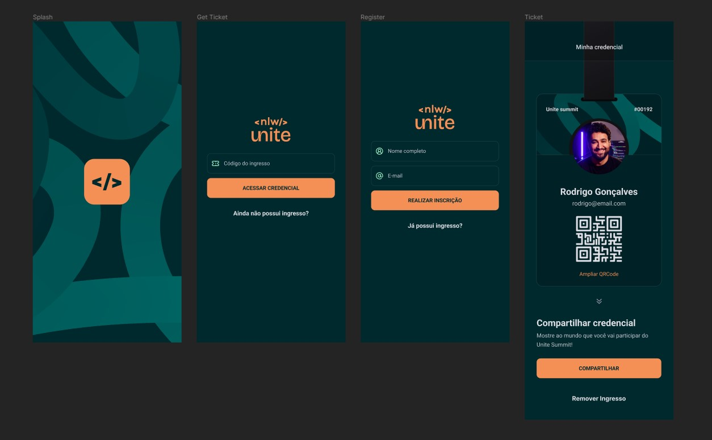

# Pass-in app 💜

Bem-vindo ao repositório do Pass-in, um aplicativo de gerenciamento de credenciais de participantes! Ele permite que os participantes de eventos gerenciem suas credenciais de forma conveniente. 
Os participantes podem gerar um código de credencial, se inscrever em eventos, fazer upload de uma foto e usar QRCode para fazer o check-in. O projeto foi desenvolvido durante o evento NLW Unite realizado pela [@Rocketseat](https://github.com/Rocketseat).


---
## 💻 Features
- **Registrar:** Os participantes caso não possuam um ingresso podem se registrar no evento
- **Personalizar credencial:** Os participantes podem personalizar sua credencial alterando sua foto
- **QRCode:** Os participantes podem utilizar seu QRCode para fazer o check-in no evento de forma rápida e sem complicações
- **Compartilhar Credencial:** Os participantes podem compartilhar suas credenciais através de um link
- **Remover ingresso:** Os participantes podem remover o seu ingresso na página da credencial

## 🌐 Tecnologias utilizadas
- [React Native](https://reactnative.dev)
- [Typescript](https://typescriptlang.org)
- [Expo](https://expo.dev)
- [Nativewind](https://nativewind.dev)
- [Zustand](https://zustand-demo.pmnd.rs)
- [Node.js](https://nodejs.org)
- [Moti](https://moti.fyi)

## 🚀 Iniciando o projeto

O nosso app possui um servidor back-end separado, portanto o processo de inicialização será um pouco diferente.
### App
```sh
#Clone o repositorio
$ git clone https://github.com/nichol6s/pass-in-app

#Instale as dependências
$ npm install

#Inicie o app
$ npx expo start 
```
### Back-end
Para ter acesso ao servidor back-end vá para o seguinte repositorio: [Back-End Node](https://github.com/nichol6s/pass-in-backend)
```sh
#Clone o repositorio
$ git clone https://github.com/nichol6s/pass-in-backend

#Instale as dependências
$ npm install

#Crie um arquivo .env na raiz do projeto e dentro dele coloque:
"DATABASE_URL="file:./dbsqlite.db”

#Execute o comando
$ npx prisma generate

#Execute o comando
$ npx prisma db seed

#Inicie o servidor
$ npm run dev

#Para visualizar o banco de dados através do Prisma Studio execute o comando
$ npx prisma studio #Certifique-se de que o Android Studio não esteja aberto nessa hora

```


